# Model Onboarding Architecture

## Overview
This diagram shows the automated model onboarding flow across the four nine-thousand repositories.

```mermaid
graph TD
    A[👤 Data Scientist] -->|1. Add model metadata JSON| B[📁 nine-thousand-models]
    
    B -->|2. Triggers| C[🔄 nine-thousand-pipeline<br/>model-pipeline]
    
    C -->|3. Triggers| D[🧠 nine-thousand-kfp<br/>Data Science Pipeline<br/>Kubeflow Pipeline]
    
    D -->|4. Trains model| E[🎯 Trained Model Artifacts]
    
    E -->|5. Returns to| C
    
    C -->|6. Creates| F[📦 ModelCar Image<br/>Container with model artifacts]
    
    C -->|7. Updates GitOps repo| G[📁 nine-thousand-models-gitops]
        
    G -->|8. Push changes| G
    
    G -->|9. Detects changes| I[🔄 Argo CD ApplicationSet]
    
    I -->|10. Deploys to| J[🧪 Test Environment]
    
    C -->|11. Creates PR| K[📋 PR to update prod/<br/>nine-thousand-models-gitops]
    
    K -->|12. After approval & merge| L[🏭 Production Environment]

    style A fill:#e1f5fe
    style B fill:#f3e5f5
    style C fill:#fff3e0
    style D fill:#e8f5e8
    style G fill:#f3e5f5
    style I fill:#fff3e0
    style J fill:#e1f5fe
    style L fill:#ffebee
```

## Step-by-Step Flow

### 1. Model Definition
- **Actor**: Data Scientist
- **Action**: Add model metadata JSON file to `nine-thousand-models` repository
- **Contains**: Data sources, hyperparameters, deployment configuration

### 2. Pipeline Trigger
- **Component**: `nine-thousand-pipeline`
- **Trigger**: GitHub webhook from models repository
- **Pipeline**: `model-pipeline` execution begins

### 3. Data Science Pipeline Execution
- **Component**: `nine-thousand-kfp` (Kubeflow Pipeline)
- **Actions**:
  - Fetch data from multiple sources (GitHub, DVC, Feast)
  - Validate datasets
  - Preprocess data
  - Train Keras model
  - Convert to ONNX format
  - Evaluate performance
  - Register model

### 4. Model Training
- **Output**: Trained model artifacts
- **Storage**: Model registry

### 5. ModelCar Creation
- **Component**: `nine-thousand-pipeline`
- **Action**: Creates container image containing model artifacts
- **Result**: ModelCar image with unique tag

### 6-8. GitOps Repository Update
- **Component**: `nine-thousand-pipeline`
- **Actions**:
  - Creates new folder in `nine-thousand-models-gitops/test/`
  - Generates `config.yaml` with:
    - ModelCar image tag
    - Deployment configuration
    - Environment-specific settings
  - Commits and pushes changes

### 9-11. Test Deployment
- **Component**: Argo CD ApplicationSet
- **Process**:
  - Detects new `config.yaml` in test directory
  - Uses ML Helm charts for deployment
  - Auto-syncs to test environment
  - Self-healing deployment

### 12-13. Production Deployment
- **Component**: `nine-thousand-pipeline`
- **Process**:
  - Creates Pull Request to production directory
  - Manual review and approval required
  - After merge, Argo CD deploys to production environment

## Repository Responsibilities

| Repository | Purpose | Key Components |
|------------|---------|----------------|
| `nine-thousand-models` | Model definitions | JSON configuration files |
| `nine-thousand-pipeline` | Orchestration | Tekton pipelines, tasks, triggers |
| `nine-thousand-kfp` | ML Training | Kubeflow pipelines, training logic |
| `nine-thousand-models-gitops` | Deployment | Argo CD ApplicationSets, environment configs |

## Technology Stack

- **CI/CD**: Tekton Pipelines
- **ML Pipelines**: Kubeflow Pipelines (KFP)
- **GitOps**: Argo CD ApplicationSets
- **Containerization**: ModelCar images
- **Security**: Image scanning, signing (cosign), SBOM generation
- **Deployment**: Helm charts